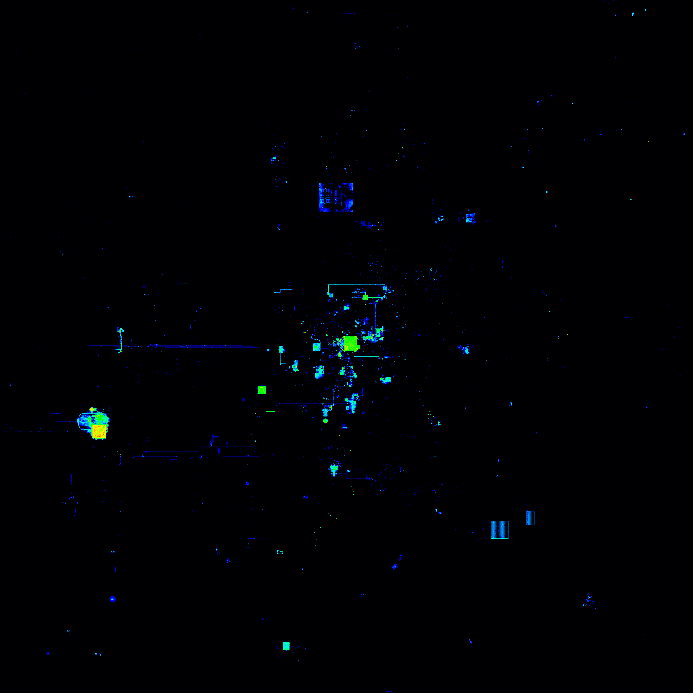
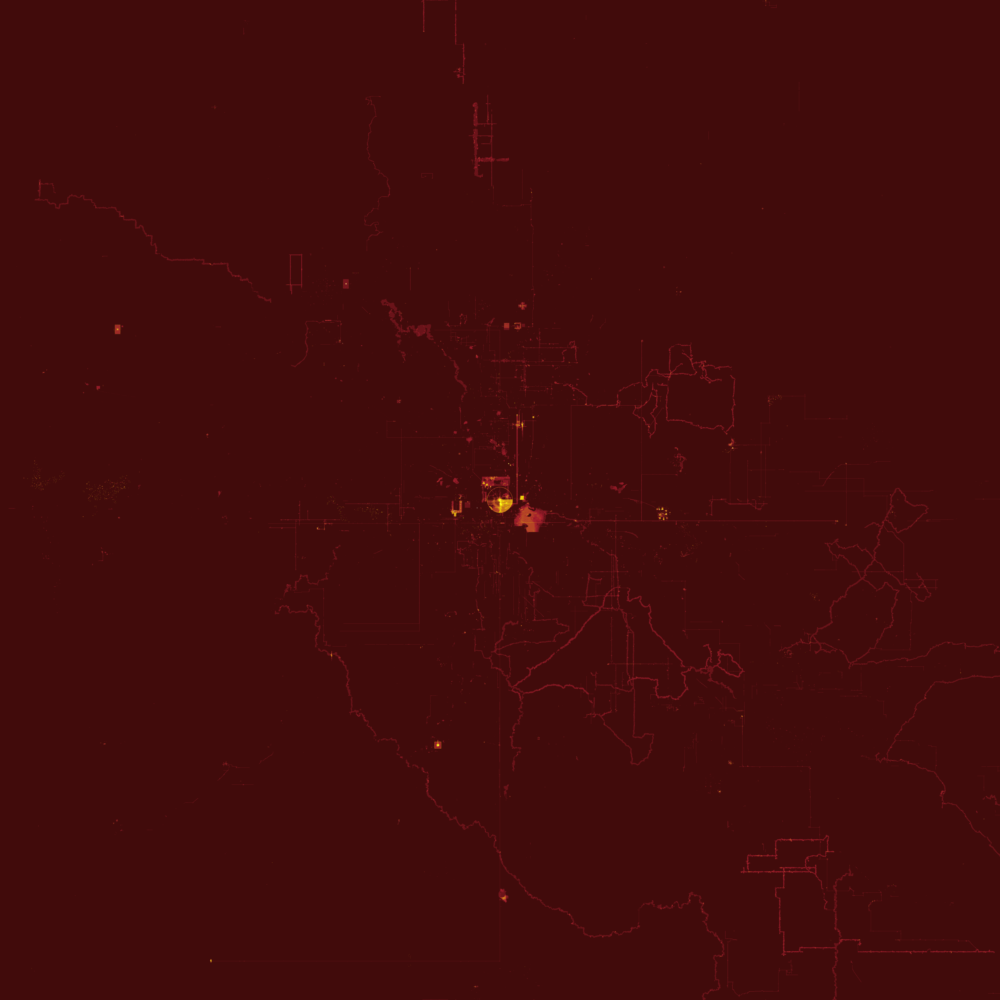

# Minecraft-Heatmap
Create a heatmap of your server based on block interaction (block breaking and placing).

It uses the logs of the [Ledger mods](https://github.com/QuiltServerTools/Ledger), and the MySQL configuration of the [Ledger Database](https://github.com/QuiltServerTools/Ledger-Databases) mod extension.

## Usage

```
python3 heatmap.py [OPTIONS]

Options:
    -h, --help              Show this message and exit. Defaults values are in []
    -s, --size SIZE         Map radius. /!\ Generated image will be 2x this size. [2000]
    -w, --world WORLD       The world to make the map from. Defaults choices are {[overworld], the_nether, the_end}
    -p, --palette FILE      Heatmap palette. Should be a filename in the 'palettes' folder. [rgb]

Example:
    python3 heatmap.py -s 200 -w the_nether -p nether
```

## Custom palettes

You can add your own custom palette by adding them in the `palettes` folder.
For a better result, the image should have a **width of at least 256px**.
You can generate gradients image easily using a [website maker](https://angrytools.com/gradient/image/), or any tool that you want.

## Result examples

`python3 heatmap.py` (equivalent to `python3 heatmap.py -s 2000 -w overworld -p rgb`)


`python3 heatmap.py -w the_nether -p nether`
